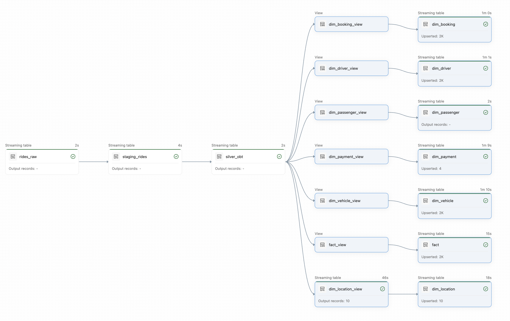

## Real-Time Ride Sharing Data Platform (Azure/Databricks)

### Overview
*This project builds an end-to-end real-time data pipeline for a ride-booking system using Azure. It combines streaming + batch ingestion and* 
*transforms data into an analytics-ready star schema.*

---

---

### Architecture
- **TinyAPI/FastAPI** → generates ride events  
- **Azure Event Hubs (Kafka)** → streaming ingestion  
- **Azure Data Factory** → batch ingestion (GitHub → ADLS)  
- **ADLS Gen2** → storage (Bronze layer)  
- **Databricks (Spark)** → processing (Bronze → Silver → Gold)  
- **Gold Layer** → Star schema (Fact + Dimensions)

---

### Key Features
- **Pub/Sub streaming architecture**
- **Metadata-driven pipelines (ADF Lookup + params)**
- **Medallion Architecture (Bronze, Silver, Gold)**
- **One Big Table (OBT)** using streaming joins + watermarking  
- **Jinja-based modular SQL transformations**
- **Star schema** (1 fact + 6 dimension tables)
- **SCD Type 1 & 2** using autoCDC  
- **End-to-end orchestration** via Databricks Jobs

---

### Tech Stack
- **Languages:** Python (PySpark, FastAPI), SQL, Jinja2  
- **Azure:** Event Hubs, Data Factory, Databricks, ADLS Gen2  
- **Frameworks:** Spark Structured Streaming, SDP/DLT, Kafka  

---

### Workflow
1. **Bronze:** Raw streaming + batch ingestion  
2. **Silver:** One Big Table (OBT) combining all sources  
3. **Gold:** Star schema for analytics  

---